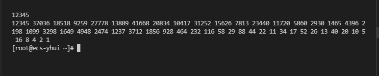
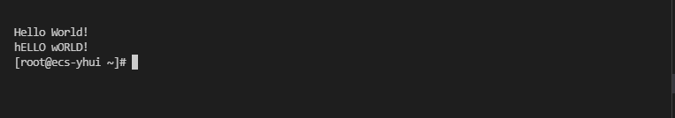

# 进程控制实验

## 实验内容

实验目的是学习操作系统进行进程控制的API，实验分为3个程序，分别练习了`fork()`, `shm_open() ftruncate() mmap()`和`pipe()`三个API。

### 实验一

利用`fork()`函数在子进程中完成Collatz猜想，并输出结果。父进程需等待子进程结束。

### 实验二

利用内存共享技术，子进程在完成计算后将计算结果放到共享内存中，父进程从共享内存中读入信息后输出，最后需将共享内存中的内容删除。

### 实验三

利用管道技术，将父进程传给子进程的字符串大小写反转，然后返回给父进程。

## 实验设计

三个实验分三个文件编写，文件内容按照API使用方法，完成程序。

## API说明

- `pid_t fork()`用于创建一个子进程，函数将会返回一个pid，子进程的pid总为0，如果pid为负数，则说明函数执行失败。
- `pid_t wait (int * status)`用在父进程中，用于父进程等待子进程完成，父进程执行到该函数后会阻塞直到子进程结束。该函数接受一个参数，子进程的结束状态值将会赋值给`status`值。
- `int shm_open(const char *name, int oflag, mode_t mode)`该函数用于创建一个共享内存，`name`用于标识共享内存，由于共享内存是基于文件的，所以在`/dev/shm`中的文件名称是和name相同的。`oflag`参数是打开选项，有`O_CREAT`,`O_REWR`等。最后一个参数用于设置内存对象的目录权限。返回值是一个文件描述符。
- `int ftruncate(int fd, off_t length)`该函数用于设置内存大小。
- `void *mmap(void *addr, size_t length, int prot, int flags, int fd, off_t offset)`该函数用于将`shm_open`创建的文件加载到内存，第一个参数用于指定将要加载到内存的地址，第二个参数用于指定内存长度，第三个用于指定内存读写方式，第四个用于指定内存共享方式，只有设置为`MAP_SHARED`才能被其他进程所访问。第五个是将要加载文件的文件描述符，第六个参数是偏移量。
- `int shm_unlink(const char *name)`用于清除`shm_open()`所创建的对象。
- `int pipe(int pipefd[2])`用于创建管道，接受一对文件描述符，函数将会设置这两个文件描述符，创建管道失败将会返回-1，下标为0的文件描述符用于读出内容，下标为1的用于读出。

## 运行结果

- 实验1

- 实验2

- 实验3

## 实验总结

实验2出现`undefined reference to 'shm_open'`错误，在查阅linux文档后，发现在编译时需要连接关联库。

在命令中添加`-lrt`。

